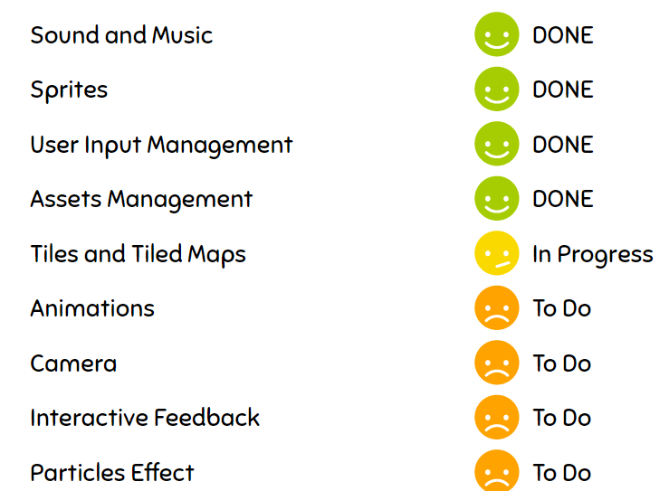

# Winter <!--[](https://travis-ci.org/apiorno/Winter) -->
   

 Winter is the new and updated version of [Storm][] from [Esteban][] . It is a  2D Game Framework Development using FFI with [Chipmunk2D Physics Engine][].
 
 ## Problems
 
  #### Chipmunk2D is temporarily disabled because of VM crashes problems on Linux and could not build properly on Windows. Physics temporarily simulated in Smalltalk.
  
  #### Sound does not work on pharo for linux distributions, framework works fine but you will not hear sounds on Linux.
 
 ## Supported Media Files
 
   ### Sound 
      At the moment .aiff and .wav sound extensions are supported
   ### Images
      .bmp , .gif, .jpeg and .png image extensions are supported.
        
 ## New Features
   
 
 ## Network
   #### After releasing Winter ( having main features done to make all kind of 2D game) i will work on Network API for LAN and Online Games.
   
 ## Instructions
  
  - Open a Playground and evaluate:

```smalltalk
Metacello new
  baseline: 'Winter';
  repository: 'github://apiorno/Winter:master/source';
  load
```
 ## Run Arkanoid example
  Copy files on "Game Examples files" to the image directory
  And then run this on playground:
  
  ```smalltalk
ArkanoidGame new start
```

[esteban]: https://github.com/estebanlm
[storm]: https://github.com/cdlm/pharo-storm
[chipmunk2d physics engine]:https://chipmunk-physics.net/
